# 👁️ AI Vision Project
## Overview

The AI Vision Project leverages image classification and object detection to monitor production processes in real time. It tracks cycle times, detects missing parts, and ensures accuracy in assembly and packing processes.

---

## Features

- ⏱️ Cycle Time Tracking: Detects part absence to calculate real-time cycle time per process.

- 🧩 Part Missing Tracking: Uses object detection to flag missing parts at specific packing steps.

- 🖥️ Hardware setup with Tinker Board + Debian OS, USB camera, alarm speaker, and display monitor.

🤖 AI-powered models trained with industry-standard tools.

---

## Technologies

- Programming: Python (VS Code)

- Libraries: OpenCV, PyTorch, Keras, TensorFlow

- Training Tools: Roboflow, Teachable Machine, Google Colab

- Hardware: Tinker Board (Debian), USB camera, alarm speaker, display monitor
---

## Workflow

- USB camera captures real-time images of assembly/packing process.

- AI model (classification/detection) identifies part presence or absence.

- System logs cycle time or triggers alarm/display alerts for missing parts.

- Models trained and scaled with Roboflow, Colab, and Teachable Machine.

## 1) System Architecture (Runtime)
Four cooperating subsystems run across three devices. Their working directories and key files are listed exactly as used at runtime.

This document expands on the architecture shown in **`file.md`** (Mermaid diagram) and explains:
- **System Architecture** (runtime components and how they interact)
- **Model Training Procedure** for both detection tasks
- **Hardware Setup Procedure** (installers and required files)
- Cross-component **relationships**, data flows, and sanity checks

```mermaid
---
config:
  layout: elk
---
flowchart TB
 subgraph PMT["Part Missing Tracking - Tinker Board Edge R"]
    direction TB
        PMT_main["StepTracking_DY08_P7_main_30.py"]
        PMT_cfg["config_DY08_P7_StepTracking.csv"]
        PMT_alarm["alarm.wav"]
        PMT_model_main["models/EH-NA0K-K/model_EH-NA0K-K.tflite"]
        PMT_model_glob["models/.../....tflite"]
        PMT_model_def["model_default.tflite"]
  end
 subgraph CTT["Cycle Time Tracking - Tinker Board 2s"]
    direction TB
        CTT_main["CycleTime_DY08_P1_main_11.py"]
        CTT_cfg1["dataset/config_data_DY08_P1.csv"]
        CTT_cfg2["dataset/const_data_DY08_P1.csv"]
        CTT_mask["dataset/mask_img_DY08_P1_S1.png"]
        CTT_model_main["dataset/models/EH-NA0K-K/model_DY08_P1_S1.tflite"]
        CTT_model_glob["dataset/models/.../....tflite"]
        CTT_model_def["dataset/model_default.tflite"]
  end
 subgraph VIS["Assembly Line Visualization - Host PC"]
    direction TB
        VIS_py["CycleTime_DY-08_host_14.py"]
        VIS_csv["data_DY08_2025-03-07.csv"]
  end
 subgraph CCTV["CCTV Assembly Line - Tinker Board Edge R #2"]
    direction TB
        CCTV_py["CycleTime_DY08_P1_main_13_stream.py"]
  end
 subgraph SA["System Architecture"]
    direction TB
        PMT
        CTT
        VIS
        CCTV
  end
 subgraph MTP_PMT["Part Missing Tracking"]
    direction LR
        cap_pmt["CaptureImageSample.py"]
        raw_pmt["record_20250210_080734"]
        roboflow["Roboflow:<br>2.1 Multi‑Layer Object Detection Annotation<br>2.2 Augmentation<br>2.3 Export: YOLOv5 PyTorch"]
        colab_pmt["Google Colab:<br>Model Training Tool/yolov5_training_template.ipynb"]
        out_pmt["Trained OD Model<br>(TFLite fp32)"]
        save_pmt["Store to:<br>models/EH-NA0K-K/model_EH-NA0K-K.tflite"]
  end
 subgraph MTP_CTT["Cycle Time Tracking"]
    direction LR
        cap_ctt["Image capture via<br>CycleTime_DY08_P1_main_11.py"]
        raw_ctt["dataset/Image_capture_DY_08_P1_2025-08-16_08-46-25"]
        tools_ctt["Dataset Processing Tool:<br>Image_Classifier/image_classifier_final_F1.py<br>Data_Augmentation/data_augmentation_tool.py"]
        steps_ctt["2.1 Auto‑label (EMPTY/NOT_EMPTY/OTHER)<br>2.2 Augment images"]
        teachable["Train in Teachable Machine"]
        out_ctt["Trained Model<br>(TFLite int8)"]
        save_ctt["Store to:<br>dataset/models/EH-NA0K-K/model_DY08_P1_S1.tflite"]
  end
 subgraph MTP["Model Training Procedure"]
    direction TB
        MTP_PMT
        MTP_CTT
  end
 subgraph HW_PMT["Part Missing Tracking"]
    direction TB
        HW_PMT_inst["Run installer:<br>Hardware Setup/Tinkerboard Edge R/setup.sh"]
        HW_PMT_un["Uninstall (if needed):<br>Hardware Setup/Tinkerboard Edge R/uninstall.sh"]
  end
 subgraph HW_CTT["Cycle Time Tracking"]
    direction TB
        HW_CTT_inst["Run installer:<br>Hardware Setup/Tinkerboard 2s/setup.sh"]
        HW_CTT_un["Uninstall (if needed):<br>Hardware Setup/Tinkerboard 2s/uninstall.sh"]
  end
 subgraph HW_VIS["Assembly Line Visualization"]
    direction TB
        HW_VIS_req["Manual Windows setup:<br>Hardware Setup/Host PC Setup/requirements.txt"]
  end
 subgraph HW_CCTV["CCTV Assembly Line"]
    direction TB
        HW_CCTV_inst["Run installer:<br>Hardware Setup/Tinkerboard Edge R/setup.sh"]
        HW_CCTV_un["Uninstall (if needed):<br>Hardware Setup/Tinkerboard Edge R/uninstall.sh"]
        HW_CCTV_mtx["CCTV_AssemblyLine/mediamtx<br>Config: mediamtx.yml"]
  end
 subgraph HW["Hardware Setup Procedure"]
    direction TB
        HW_PMT
        HW_CTT
        HW_VIS
        HW_CCTV
  end
    cap_pmt --> raw_pmt
    raw_pmt --> roboflow
    roboflow --> colab_pmt
    colab_pmt --> out_pmt
    out_pmt --> save_pmt
    cap_ctt --> raw_ctt
    raw_ctt --> tools_ctt
    tools_ctt --> steps_ctt
    steps_ctt --> teachable
    teachable --> out_ctt
    out_ctt --> save_ctt
    repo(["GitHub Repo<br>AI_Vision_HairDryerAssembly"]) --- PMT & CTT & VIS & CCTV
    save_pmt --> PMT_model_main
    save_ctt --> CTT_model_main
    PMT -- events/alarms --> VIS
    CTT -- cycle times/CSV --> VIS
    CCTV -- video stream --> VIS
    HW_PMT_inst --> PMT
    HW_CTT_inst --> CTT
    HW_VIS_req --> VIS
    HW_CCTV_inst --> CCTV
    HW_CCTV_mtx --> CCTV
    style PMT fill:#FFE0B2
    style CTT fill:#BBDEFB
    style VIS fill:#2962FF
    style CCTV fill:#FFF9C4
    style MTP_PMT fill:#FFD600
    style MTP_CTT fill:#BBDEFB
    style HW_PMT fill:#FFE0B2
    style HW_CTT fill:#BBDEFB
    style HW_VIS fill:#2962FF
    style HW_CCTV fill:#FFF9C4
    style HW stroke:#2962FF
    style SA stroke:#00C853
    style MTP stroke:#D50000
    click repo "https://github.com/giftjira/AI_Vision_HairDryerAssembly"
```


### 1.1 Part Missing Tracking — *Tinker Board Edge R*

**Role:** Real‑time object detection for missing/misaligned parts; raises audible alarm and events.

**Key files (working directory):**
```
StepTracking_DY08_P7_main_30.py
config_DY08_P7_StepTracking.csv
alarm.wav
models/EH-NA0K-K/model_EH-NA0K-K.tflite
models/.../....tflite
model_default.tflite
```

**Inputs & processing**
- Camera frames from the assembly station.
- `StepTracking_DY08_P7_main_30.py` loads a **TFLite (fp32)** object detection model and interprets detections using thresholds/regions configured in `config_DY08_P7_StepTracking.csv`.
- On missing-part condition, triggers `alarm.wav` and emits an event (consumed by the visualization).

**Outputs**
- Event stream (OK / MISSING / ERROR)
- Optional logs and snapshots (implementation-dependent)
- Alarm audio on failure

---

### 1.2 Cycle Time Tracking — *Tinker Board 2s*

**Role:** Detect **EMPTY / NOT_EMPTY / OTHER** state transitions at workstations to compute cycle time, then persist metrics.

**Key files (working directory):**
```
CycleTime_DY08_P1_main_11.py
dataset/config_data_DY08_P1.csv
dataset/const_data_DY08_P1.csv
dataset/mask_img_DY08_P1_S1.png
dataset/models/EH-NA0K-K/model_DY08_P1_S1.tflite
dataset/models/.../....tflite
dataset/model_default.tflite
```

**Inputs & processing**
- Video frames and ROI mask (`dataset/mask_img_DY08_P1_S1.png`).
- `CycleTime_DY08_P1_main_11.py` loads a **TFLite (int8)** classifier to label each frame (EMPTY / NOT_EMPTY / OTHER).  
- State transitions → timestamps → **cycle-time** per station/part.

**Outputs**
- Time-series and per-cycle metrics (often CSV consumed by the Host PC visualization).

> Note: Some notes may show the mask path as `dataset/ mask_img_DY08_P1_S1.png`. Use the no-space path `dataset/mask_img_DY08_P1_S1.png` for consistency.

---

### 1.3 Assembly Line Visualization — *Host PC*

**Role:** Consolidate real-time events, cycle-time metrics and live streams for operator dashboards.

**Key files (working directory):**
```
CycleTime_DY-08_host_14.py
data_DY08_2025-03-07.csv
```

**Inputs**
- Part-missing **event** feed from Edge R.
- Cycle-time **CSV / data** exported by Tinker Board 2s.
- Live **CCTV** stream(s) for context (see §1.4).

**Outputs**
- On-screen dashboards, charts, alarms, and exportable reports (script-defined).

---

### 1.4 CCTV Assembly Line — *Tinker Board Edge R (another unit)*

**Role:** Provide live video stream(s) of the line for monitoring and to aid investigation.

**Key files:**
```
CycleTime_DY08_P1_main_13_stream.py
CCTV_AssemblyLine/mediamtx
CCTV_AssemblyLine/mediamtx.yml
```

**Processing & outputs**
- Starts camera capture and exposes an RTSP/RTMP/WEBRTC stream via **mediamtx** using `mediamtx.yml` configuration.
- Visualization clients can subscribe to live streams.

---

### 1.5 End‑to‑End Data Flow (Relationship Summary)

- **Training outputs → Runtime models**  
  - `models/EH-NA0K-K/model_EH-NA0K-K.tflite` (fp32) → used by **Part Missing Tracking**.  
  - `dataset/models/EH-NA0K-K/model_DY08_P1_S1.tflite` (int8) → used by **Cycle Time Tracking**.

- **Runtime → Visualization**  
  - Part Missing Tracking emits **events/alarms** → Visualization.  
  - Cycle Time Tracking exports **metrics/CSV** → Visualization.  
  - CCTV exposes **live stream(s)** → Visualization.

- **Host PC** correlates **events + metrics + video** to present a complete operational view.

---

## 2) Model Training Procedure

Two distinct training pipelines are used: **Object Detection** for part-missing, and **Image Classification** for cycle-time state.

### 2.1 Part Missing Tracking — *Object Detection (TFLite fp32)*

**Working directory (same host as runtime project root):**
```
CaptureImageSample.py
record_20250210_080734
```

**Flow**
1. **Capture samples** with `CaptureImageSample.py` → raw images in `record_20250210_080734`.
2. **Roboflow**
   - 2.1 Multi‑Layer **Object Detection** annotation
   - 2.2 **Augmentation**
   - 2.3 **Export** dataset as **YOLOv5 PyTorch**
3. **Train** on Google Colab: `Model Training Tool/yolov5_training_template.ipynb`
4. **Export** trained model to **TFLite (floating‑point fp32)**
5. **Deploy** by copying to: `models/EH-NA0K-K/model_EH-NA0K-K.tflite`

**Notes & tips**
- Keep class names consistent between Roboflow and inference code.  
- Validate with a held‑out set; monitor precision/recall for **missing critical parts**.  
- Keep a **fallback** `model_default.tflite` for safe rollback.

---

### 2.2 Cycle Time Tracking — *Image Classification (TFLite int8)*

**Working directory (same project root):**
```
dataset/Image_capture_DY_08_P1_2025-08-16_08-46-25
Dataset Processing Tool/Image_Classifier/image_classifier_final_F1.py
Dataset Processing Tool/Data_Augmentation/data_augmentation_tool.py
```

**Flow**
1. **Capture samples** via `CycleTime_DY08_P1_main_11.py` → raw images in  
   `dataset/Image_capture_DY_08_P1_2025-08-16_08-46-25`
2. **Dataset Processing Tool**
   - 2.1 Auto‑classify frames into **EMPTY / NOT_EMPTY / OTHER** using  
     `Image_Classifier/image_classifier_final_F1.py`
   - 2.2 **Augment** images with  
     `Data_Augmentation/data_augmentation_tool.py`
3. **Train** using **Teachable Machine**
4. **Export** to **TFLite (int8 quantized)**
5. **Deploy** by copying to:  
   `dataset/models/EH-NA0K-K/model_DY08_P1_S1.tflite`

**Notes & tips**
- Ensure class balance after auto‑classification; augmentation can help mitigate skew.  
- Quantized (int8) models provide **speed** and **small footprint** on embedded devices.  
- Maintain `dataset/model_default.tflite` for rollback.

---

## 3) Hardware Setup Procedure

### 3.1 Part Missing Tracking — *Edge R*
- **Install:** `Hardware Setup/Tinkerboard Edge R/setup.sh`  
- **Uninstall (if needed):** `Hardware Setup/Tinkerboard Edge R/uninstall.sh`

### 3.2 Cycle Time Tracking — *Tinker Board 2s*
- **Install:** `Hardware Setup/Tinkerboard 2s/setup.sh`  
- **Uninstall (if needed):** `Hardware Setup/Tinkerboard 2s/uninstall.sh`

### 3.3 Assembly Line Visualization — *Host PC*
- **Manual Windows setup** per: `Hardware Setup/Host PC Setup/requirements.txt`

### 3.4 CCTV Assembly Line — *Edge R*
- **Install:** `Hardware Setup/Tinkerboard Edge R/setup.sh`  
- **Uninstall (if needed):** `Hardware Setup/Tinkerboard Edge R/uninstall.sh`  
- **Streaming service:** `CCTV_AssemblyLine/mediamtx` with `CCTV_AssemblyLine/mediamtx.yml`

---

## 4) Directory Map (Key Artifacts)

```
AI_Vision_HairDryerAssembly/
├─ StepTracking_DY08_P7_main_30.py
├─ config_DY08_P7_StepTracking.csv
├─ alarm.wav
├─ models/
│  └─ EH-NA0K-K/
│     └─ model_EH-NA0K-K.tflite      # Part Missing model (fp32)
│  └─ .../....tflite
├─ dataset/
│  ├─ config_data_DY08_P1.csv
│  ├─ const_data_DY08_P1.csv
│  ├─ mask_img_DY08_P1_S1.png
│  ├─ model_default.tflite
│  ├─ models/
│  │  ├─ EH-NA0K-K/
│  │  │  └─ model_DY08_P1_S1.tflite   # Cycle Time model (int8)
│  │  └─ .../....tflite
│  └─ Image_capture_DY_08_P1_2025-08-16_08-46-25/
├─ CycleTime_DY08_P1_main_11.py
├─ CycleTime_DY08_P1_main_13_stream.py            # CCTV streaming
├─ CycleTime_DY-08_host_14.py                     # Host visualization
├─ data_DY08_2025-03-07.csv
├─ CaptureImageSample.py
├─ record_20250210_080734/
├─ Model Training Tool/
│  └─ yolov5_training_template.ipynb
├─ Dataset Processing Tool/
│  ├─ Image_Classifier/
│  │  └─ image_classifier_final_F1.py
│  └─ Data_Augmentation/
│     └─ data_augmentation_tool.py
├─ CCTV_AssemblyLine/
│  ├─ mediamtx
│  └─ mediamtx.yml
└─ Hardware Setup/
   ├─ Tinkerboard Edge R/
   │  ├─ setup.sh
   │  └─ uninstall.sh
   ├─ Tinkerboard 2s/
   │  ├─ setup.sh
   │  └─ uninstall.sh
   └─ Host PC Setup/
      └─ requirements.txt
```
---

### At a glance — Relationships
- **Training → Deployment:** Roboflow/Colab (OD) and Teachable Machine (CLS) produce TFLite models stored in **models/** and **dataset/models/** respectively.
- **Deployment → Monitoring:** Runtime scripts consume those models to emit events, alarms, and cycle-time metrics.
- **Monitoring → Visibility:** Host PC visualization consolidates everything with optional CCTV live feeds.

---
